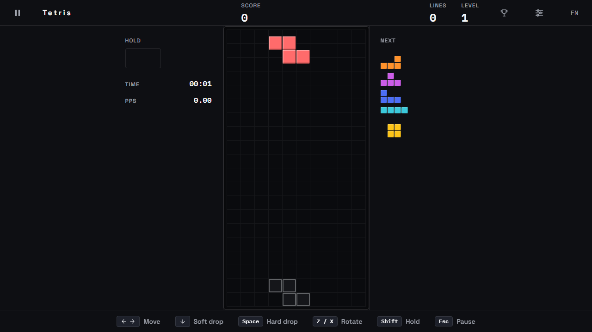

# 🟦 Duck Stack — the modern Tetris Guideline, kick tables and all

[](https://github.com/LeVanAnhDuc/web-game-duck-stack/actions/workflows/ci.yml)
[](https://github.com/LeVanAnhDuc/web-game-duck-stack/actions/workflows/deploy.yml)
[](https://github.com/LeVanAnhDuc/web-game-duck-stack/releases)

Duck Stack is Tetris on the modern Guideline, running entirely in the browser. No
backend, no account, no install — open the page and play.

Built for players who already have Guideline reflexes: full SRS with wall kicks,
7-bag, hold, ghost piece, lock delay with move reset, T-spin, combo and
back-to-back. Getting one of those details wrong is the difference between a Tetris
that feels right and one that feels broken, so the rules live in a pure,
deterministic engine that is tested against the published kick tables rather than
against how it looks on screen.

**Play**: https://levananhduc.github.io/web-game-duck-stack/



## Features

- Marathon play on the modern Guideline: SRS rotation with wall kicks, 7-bag
  randomiser, hold, ghost piece, a five-deep next queue, soft and hard drop, lock
  delay with a capped move reset, and level-based gravity.
- Guideline scoring including T-spin and T-spin mini, combo, back-to-back and
  perfect clear.
- Keyboard controls with configurable-in-the-engine DAS/ARR, plus touch controls on
  small screens.
- Pause and resume, and an automatic pause when the tab goes to the background so a
  game is never lost to a tab switch.
- Bilingual interface, English and Vietnamese, detected from the browser and
  switchable in settings.
- A settings screen that persists: rebind every key, tune DAS and ARR, pick Easy,
  Normal, Hard or a fall speed of your own, toggle the landing hint and the smooth
  sideways motion, and a mode that marks each piece with its letter for when colour
  is not enough.
- Sound effects, synthesised rather than shipped as files, with their own mute and
  volume.
- A local high-score table, kept per difficulty because scores from different fall
  speeds are not comparable, with a display name and timestamps in your own language.
- Motion that reads as motion: pieces fall sub-cell rather than stepping a whole row
  at a time, sideways moves travel, a hard drop leaves a trail, a completed row
  flashes before the stack collapses onto it, and a tetris shakes the board. All of
  it collapses to instant state changes under `prefers-reduced-motion`.

## Controls

Read off the bar the game itself shows at the bottom of the screen, so the two can
never drift apart.

| Action     | Keys        |
| ---------- | ----------- |
| Move       | `←` `→`     |
| Soft drop  | `↓`         |
| Hard drop  | `Space`     |
| Rotate     | `Z` / `X`   |
| Hold       | `Shift`     |
| Pause      | `Esc`       |

DAS and ARR are adjustable in settings: a player with Guideline reflexes treats
those two numbers as part of the controls, not as a preference.

## Commands

```bash
npm ci
npm run dev        # dev server
npm run test       # unit tests
npm run typecheck  # tsc, no emit
npm run build      # typecheck + production build into dist/
npm run preview    # serve the production build
```

Uses **npm**, not Yarn (ADR-0001). No environment variables are needed — see
[`.env.example`](.env.example) for why that is the correct answer rather than an
omission.

## How it is put together

| Folder | Holds |
| --- | --- |
| `src/engine/` | Every rule, as pure functions. No DOM, no clock, no `Math.random` |
| `src/runtime/` | The fixed-timestep loop, the round lifecycle, replay recording |
| `src/input/` | Keyboard and touch, reporting presses and releases only |
| `src/render/` | Canvas renderer and its pre-rendered cell sprites |
| `src/i18n/` | Two flat locale files and a `t()` |
| `src/ui/` | React: screens, HUD, modals |

The engine is deterministic on purpose: a whole game is described by a seed plus the
commands and the ticks they arrived on. That is what makes replays reproducible, what
turns a rules bug into a file instead of a story, and what keeps server-side score
validation possible later without writing the rules a second time.

## Releases and versioning

Every push to `main` creates a GitHub Release by itself
([`.github/workflows/release.yml`](.github/workflows/release.yml)), and deploys to
**<https://levananhduc.github.io/web-game-duck-stack/>**
([`deploy.yml`](.github/workflows/deploy.yml)). Pull requests run tests, a build and
an audit first ([`ci.yml`](.github/workflows/ci.yml)).

Pages has to be enabled **once per repository** before the first deploy can succeed —
`configure-pages` cannot do it for you, because `GITHUB_TOKEN` is not allowed to
create a Pages site:

```bash
gh api -X POST repos/<owner>/<repo>/pages -f build_type=workflow
```

**The version comes from your commit subjects**, so they have to follow Conventional
Commits — enforced by [`.githooks/commit-msg`](.githooks/commit-msg) locally and by
[`commit-lint.yml`](.github/workflows/commit-lint.yml) on every pull request.

[git-cliff](https://git-cliff.org) reads **every commit since the previous tag**, not
just the last one, and the highest bump wins regardless of order. So one `feat:`
anywhere in a push is enough for a minor bump, and the merge commit's own subject does
not need a prefix — merging a pull request and pushing directly give the same answer,
because commits are read rather than pull requests.

| In the range since the last tag | Bump |
| --- | --- |
| `feat:` | minor — `v0.4.0` → `v0.5.0` |
| everything else | patch — `v0.4.0` → `v0.4.1` |
| `type!:` or a `BREAKING CHANGE` footer | see the 0.x rule below |

**The 0.x rule:** while the major version is `0`, a breaking change bumps the
**minor**, not the major (`breaking_always_bump_major = false` in
[`cliff.toml`](cliff.toml)). Nothing is stable before 1.0, and `1.0.0` is a claim
about completeness — so crossing to it takes the explicit marker rather than happening
on its own. The first release of this repo was `v0.1.0` for the same reason.

Three markers, read from **commit subjects across the whole range** (not from bodies —
the bodies here run long and discuss releases, which would otherwise trigger them):

- `[release minor]` / `[release major]` — force a bigger bump. `[release major]` is
  the only way to reach `1.0.0`.
- `[skip release]` — no release for this push. For CI-only changes where a release
  would be noise. Never use it on a push that also carries a `feat:`, or you cancel
  that feature's release too.

Earlier versions of this workflow read the markers from **HEAD's subject alone**. With
a pull-request flow that subject is always `Merge pull request #N from …`, written by
GitHub, so no marker was ever reachable. They are read from the range now.

**The notes are composed from the commit subjects**, grouped by type with breaking
changes first — the groups live in [`cliff.toml`](cliff.toml), which is also the single
source of truth for which types the commit hook accepts. Not from `--generate-notes`,
which lists merged pull requests and therefore says nothing at all when a push was
direct commits.

Both halves run locally, so you can see what a release will say before it says it:

```bash
npm run release:next     # which tag the next release would get
npm run release:notes    # what its notes would say
```

**The README is not automated.** Any `feat:` that changes what a player can do must
update the `## Features` section above **in the same branch**, in the existing style —
one short English bullet. A README-only sync uses `docs:`, and never carries
`[skip release]`.

## Documentation

[`docs/README.md`](docs/README.md) is the map. Start there — it lists what each
document answers and whether it is filled in. Decisions and the reasoning behind them
are one file each under [`docs/decisions/`](docs/decisions/README.md).
